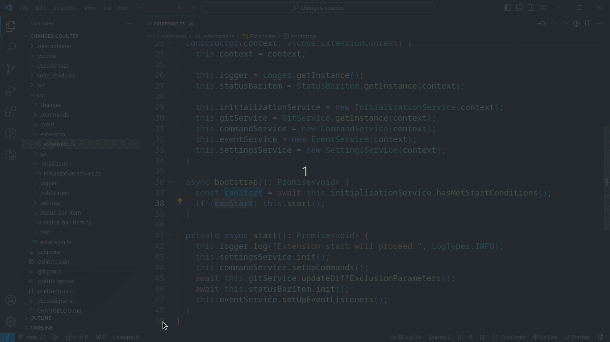

# Changes Counter

> A VS Code extension that helps developers control their pull requests size.

## Contents

- [Features](#features)
- [Installation](#installation)
- [Usage](#usage)
- [Extension Settings](#extension-settings)
- [Contributing](#contributing)
- [Built with](#built-with)
- [License](#license)

## Features

- Show the changes count in a VS Code status bar item to help you track the changes quantity
- Changes count is updated everytime you save a file
- When you exceed a changes quantity threshold:
  - The status bar item color changes
  - A notification is sent to warn you
- Creating an ignore file allows the extension to ignore files and patterns when counting changes

## Installation

Open VS Code, press Ctrl + P and enter this command

`ext install LeonardoHolanda.changes-counter`

You can also search for "Changes Counter" in the Extensions Tab search, find the extension and install it there.

## Usage

After you installed the extension and opened your repository folder for the first time, the extension will try to:

- Set the default comparison branch to your current branch
- Set the default changes threshold to 400

You can change both the comparison branch and changes threshold anytime you want by pressing `cmd + shift + p` and executing one of the extension commands:

- `Changes Counter: Set comparison branch`

- `Changes Counter: Set changes quantity threshold`

Or clicking the tooltip links.

From now on, anytime you save a file the status bar item at the bottom will update showing how many changes were made between your working tree and your comparison branch (e.g: `Changes: 64`).

### Important

**For the extension to work, you must open a folder in your workspace that is a Git repository.**

If you are experiencing any prolem, please do the following:

- Open the panel where the terminal is located.
- Select the Output tab.
- At the dropdown in the right upper part, select the Changes Counter channel.
- Check the logs.

If the problem is complicated or the logs aren't helpful, please copy the logs and create an issue with them. It will be very appreciated!

## Ignore file

The ignore file name must be **.ccignore**. For this feature to work, you must create the file in the root of your workspace folder. Then, you can write the files path and patterns you want to ignore like it is written in the .gitignore file.

## Extension Settings

This extension contributes the following settings:

- `changesCounter.disableStatusBarIconColorChange`: Enable/disable the status bar item color change when you exceed the changes quantity threshold.

- `changesCounter.disableNotifications`: Enable/disable the notification when you exceed the changes quantity threshold.

## Contributing

Feel free to submit any issues or enhancement requests! I will do my best to fix or implement it. Already have a solution? Pull requests are also welcome!

## Built with

- TypeScript
- Node.js

## License

[MIT](https://choosealicense.com/licenses/mit/)
